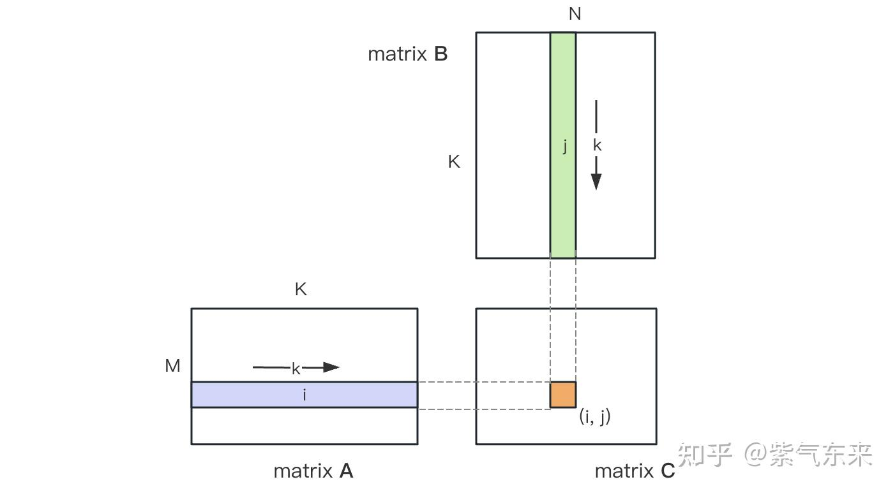

# SGEMM

参考资料：

- [通用矩阵乘法：从入门到熟练](https://zhuanlan.zhihu.com/p/657632577)
- [矩阵乘法的 CUDA 实现、优化及性能分析](https://chiemon.github.io/2020/02/06/CUDA-%E7%9F%A9%E9%98%B5%E4%B9%98%E6%B3%95-%E4%BC%98%E5%8C%96%E5%8F%8A%E6%80%A7%E8%83%BD%E5%88%86%E6%9E%90-%E4%B8%8A.html)

通用矩阵乘法 (General Matrix Multiplication，GEMM)，的定义为： $C \leftarrow \alpha AB+\beta C$，令 $\alpha=1, \beta=0$,同时使用单精度(FP32)，即SGEMM。

- 在学习gemm时，应该有CUDA编程基础。

## CPU

cpu实现很简单，使用三个for循环解决。需要注意的是输入的矩阵A和B是按行优先一维分布。

```c++
void CPU_gemm(float *hostA, float *hostB, float *hostC, int M, int N, int K) //CPU算法没什么好说的
{
    for (int i = 0; i < M; i++)
    {
        for (int j = 0; j < N; j++)
        {
            float tmp = 0;
            for (int s = 0; s < K; s++)
            {
                tmp += hostA[i * K + s] * hostB[s * N + j];
            }
            hostC[i * N + j] = tmp;
        }
    }
}
```

## naive_gemm



使用CUDA计算时，最简单的方式是每一个C中的元素使用一个线程进行计算，使用二维grid和二维的block进行。

```c++
__global__ void naive_gemm(float *a, float *b, float *c, int M, int N, int K){
    int row = blockIdx.y * blockDim.y + threadIdx.y;
    int col = blockIdx.x * blockDim.x + threadIdx.x;
    float sum = 0.f;
    for(int i=0;i<K;++i){
        sum += a[row*K+i]* b[i*N+col];
    }
    c[row*N + col] =sum;
}
```

注意事项：

- 在cuda中，使用二维grid和二维的block时，列号是x，行号是y。所以对于一个C中的元素，其行号应该为：= blockIdx.y * blockDim.y + threadIdx.y，列号应该为：= blockIdx.x * blockDim.x + threadIdx.x。

局限性：

- 对于C矩阵中的一个元素需要读取A中的一行元素，对于C中同一行的n个元素，需要读取A中同一行n次，列也一样。也就说明，为了计算A中的一行或一列元素，需要反复对同样的元素进行global memory的访存。

## share memory 优化

share memory是在每个SM内的，相比于global memory的访问，访问share memory延时小20~30倍。进行share memroy优化的要点就是先把每个warp内需要进行访问的数据线从global memroy读取到share memroy中。

```c++
#define BLOCK_SIZE 32
__global__ void sgemm_block(float *a, float *b, float *c, int M, int N, int K){
    int nRow = blockIdx.y * blockDim.y + threadIdx.y; //A矩阵中的行 同时也是C矩阵中的行
    int nCol = blockIdx.x * blockDim.x + threadIdx.x; //B矩阵中的列 同时也是C矩阵的列

    __shared__ float sliceA[BLOCK_SIZE][BLOCK_SIZE], sliceB[BLOCK_SIZE][BLOCK_SIZE]; //申请共享内存

    float sum =0.f;
    int nbk = (K + BLOCK_SIZE -1) / BLOCK_SIZE; //计算每个block的边界 这样可以防止K不能被BLOCK_SIZE整除而丢失一个block
    for(int bk = 0;bk < nbk; ++bk){ //对K维度进行分块计算
        sliceA[threadIdx.y][threadIdx.x] = a[nRow*K + bk * BLOCK_SIZE + threadIdx.x];
        sliceB[threadIdx.y][threadIdx.x] = b[(bk*BLOCK_SIZE + threadIdx.y)*N + nCol];

        __syncthreads();
        for(int k=0;k<BLOCK_SIZE;++k){
            sum += sliceA[threadIdx.y][k] * sliceB[k][threadIdx.x];
        }
        __syncthreads();
    }

    c[nRow*N+ nCol] = sum;
}
```

- 该版本gemm中，使每一个block的大小为32x32，处理C上一块32x32的元素计算。计算时需要对A和B的K维度进行分块，逐块加载到share memroy中，然后计算当前块的矩阵乘法加到sum中，所有块运算完成后再把sum存入C中的对应位置。
  
  

## float4优化，thread tile优化

- float4是cuda build-in的数据。由4个float组成(内存中按顺序存放)，float4 - 向量化访存，就是一次性读4个float。

- 小数据规模情况下，可以不考虑向量化访存的优化方式。

- 大规模数据情况下，考虑使用向量化访存，且最好是缩小grid的维度为原来的1/4，避免影响Occupancy。
* float4 向量化访存只对数据规模大的时候有加速效果，数据规模小的时候没有加速效果。

* float4 的性能提升主要在于访存指令减少了(同样的数据规模，以前需要4条指令，现在只需1/4的指令)，指令cache里就能存下更多指令，提高指令cache的命中率。

```c++
#define FLOAT4(value) (reinterpret_cast<float4*>(&(value))[0])//常用的转换方法
```


gemm的float4，thread tile优化如下：

- Block Tile: 一个16x16的block处理C上大小为128X128的一个目标块

- Thread Tile: 每个thread负责计算TM*TN(8*8)个元素，增加计算密度

- K Tile: 将K分块，每块BK大小，迭代(K+BK-1/BK)次，每次计算TM*TN个元素各自的部分乘累加

- Vectorize: 减少load和store指令，使用float4

```c++
__global__ void sgemm_thread_tile_vec4(
        float* a, float* b, float* c, int M, int N, int K) {
    constexpr int BM = 128;
    constexpr int BN = 128;
    constexpr int BK = 8;
    constexpr int TM = 8;
    constexpr int TN = 8;

    int bx = blockIdx.x;
    int by = blockIdx.y;
    int tx = threadIdx.x;
    int ty = threadIdx.y;
    int tid = threadIdx.y * blockDim.x + tx; // tid within the block
    __shared__ float s_a[BM][BK], s_b[BK][BN]; // 2*128*8*4=8KB

    // 0. 先计算shared memory中的索引
    // tid和需要加载的smem s_a[BM][BK] 之间的索引关系 BM=128 BK=8 按行读取 A行主序
    // 对于s_a每行8个数据，每个线程读取4个，需要2个线程；总共128行，需要128x2刚好256线程
    int load_smem_a_m = tid / 2; // tid/2 (128/8)*(128/8)=256 threads per block, tid/2->[0,128), BM=128 0~127
    int load_smem_a_k = (tid % 2 == 0) ? 0 : 4;  // (tid%2 == 0) ? 0 : 4, col of s_a 0,4
    // tid和需要加载的smem s_b[BK][BN] 之间的索引关系 BK=8 BN=128 按行读取 B行主序
    // 对于s_b每行128个数据，每个线程读4个数据，需要32个线程；总共8行，需要32x8=256个线程
    int load_smem_b_k = tid / 32; // tid/32, row of s_b 256/32=8 行 0~7
    int load_smem_b_n = (tid % 32) * 4;  // (tid % 32) * 4, col of s_b 0,4,...,124
    // 1. 再计算全局内存中的索引
    // 要加载到s_a中的元素对应到A全局内存中的行数 每个block负责出C中大小为BM*BN的块
    int load_gmem_a_m = by * BM + load_smem_a_m; // global row of a and c
    int load_gmem_b_n = bx * BN + load_smem_b_n; // global col of b and c

    float r_c[TM][TN] = {0.0}; // 8x8
    // 2. 先对K进行分块，每块BK大小
    for (int bk = 0; bk < (K + BK - 1) / BK; ++bk) {
        // 加载数据到共享内存smem s_a BM*BK 128*8 vectorize float4
        int load_gmem_a_k = bk * BK + load_smem_a_k; // global col of a
        int load_gmem_a_addr = load_gmem_a_m * K + load_gmem_a_k;
        FLOAT4(s_a[load_smem_a_m][load_smem_a_k]) = FLOAT4(a[load_gmem_a_addr]);
        // 加载数据到共享内存smem s_b BK*BN 8*128 vectorize float4
        int load_gmem_b_k = bk * BK + load_smem_b_k; // global row of b
        int load_gmem_b_addr = load_gmem_b_k * N + load_gmem_b_n;
        FLOAT4(s_b[load_smem_b_k][load_smem_b_n]) = FLOAT4(b[load_gmem_b_addr]);
        __syncthreads();
#pragma unroll
        for (int k = 0; k < BK; k++) {
            // 3. 每个线程负责计算BM*BN(12x128)中的TM*TN(8x8)个元素
#pragma unroll
            for (int m = 0; m < TM; m++) {
#pragma unroll
                for (int n = 0; n < TN; n++) {
                    // k from 0~7，0 ~ BK, ty and tx range from 0 to 15, 16x8=128
                    int comp_smem_a_m = ty * TM + m;  // 128*8 128/TM(8)=16 M方向 16线程
                    int comp_smem_b_n = tx * TN + n;  // 8*128 128/TN(8)=16 N方向 16线程
                    r_c[m][n] += s_a[comp_smem_a_m][k] * s_b[k][comp_smem_b_n];
                }
            }
        }
        __syncthreads();
    }

#pragma unroll
    for (int m = 0; m < TM; ++m) {
        int store_gmem_c_m = by * BM + ty * TM + m;
#pragma unroll
        for (int n = 0; n < TN; n += 4) {
            int store_gmem_c_n = bx * BN + tx * TN + n;
            int store_gmem_c_addr = store_gmem_c_m * N + store_gmem_c_n;
            FLOAT4(c[store_gmem_c_addr]) = FLOAT4(r_c[m][n]);
        }
    }
}
```


逐个部分解释

- 基本变量

```c++
    constexpr int BM = 128;
    constexpr int BN = 128;
    constexpr int BK = 8;
    constexpr int TM = 8;
    constexpr int TN = 8;

    int bx = blockIdx.x;
    int by = blockIdx.y;
    int tx = threadIdx.x;
    int ty = threadIdx.y;
    int tid = threadIdx.y * blockDim.x + tx; // tid within the block
    __shared__ float s_a[BM][BK], s_b[BK][BN]; // 2*128*8*4=8KB
```

- `constexpr`是C++11标准引入的一个新关键字，用于声明一个常量表达式。与`const`相比，`constexpr`更加强调“常量性”，即所修饰的变量或对象必须在编译时就能确定其值。

- 


